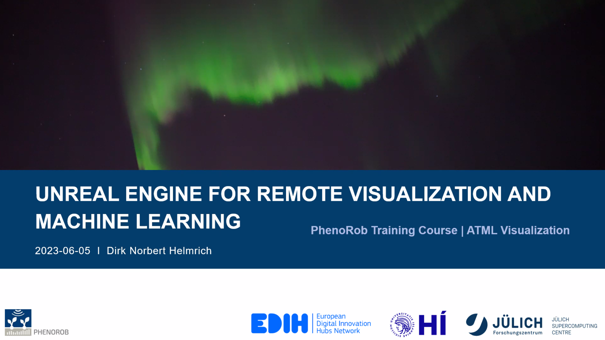

## Table of Contents
1. [Description](#description)
2. [Information](#information)
3. [Certificates](#certificates)

## Description

The Unreal Engine is one of the state-of-the-art 3D rendering engines, mainly used for game development. In recent years, however, its use in industry and science has been steadily increasing, which is further supported by new features from the producer Epic Games Inc. This course gives an in-depth training to using Unreal Engine as a data generator – by gaining measurements from virtual worlds. Using the ground truth data generated with a realistic rendering engine, projects gain more robust AI pipelines, insight into AI performance on quantifiable data, as well as measurements from virtual scenes with environmental conditions that can be manipulated. 

At the end of the course, participants have setup their own pipeline with UE and a simple ML workflow in one of the leading supercomputing centres.

## Information

The overall goals of this course were the following:

- Visualization pipelines with Unreal Engine
  - Scalability, Generalization, Domain Visualization
- Using Pixel Streaming for Remote Visualization
  - Introduction into WebRTC concepts, connectivity, and HPC usability
- Building an AI/ML pipeline from WebRTC
  - Preparing the frameworks
  - Parsing and using data
  - Best practices

All necessary information, links and content for the course can be found on the [course website](https://gitlab.jsc.fz-juelich.de/hedgedoc/s/lFvlmhs7H#).

## Certificates

The certificates for the workshop can be found bellow:

- ["Unreal Engine for Remote Visualization and Machine Learning" - Jülich Supercomputing Centre]() (Issued On: June 2023)
